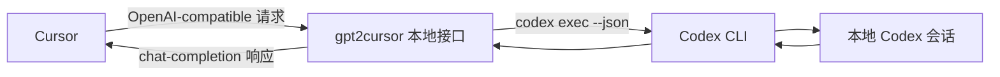

<p align="center">
  
</p>

<h1 align="center">gpt2cursor</h1>

<p align="center">
  一个精致的 macOS 菜单栏桥接工具，让 Cursor 通过 OpenAI-compatible endpoint 调用你本机已登录的 Codex CLI。
</p>

<p align="center">
  <a href="README.md">English</a>
  ·
  <a href="https://github.com/ingeniousfrog/gpt2cursor/releases">Releases</a>
</p>

<p align="center">
  
  
  
  
  
  
</p>

<p align="center">
  Last updated: 2026-06-16
</p>

## 它解决什么问题

Cursor 支持 OpenAI-compatible provider，而 Codex CLI 已经知道如何使用你本机的
Codex 登录状态。`gpt2cursor` 做的事情很克制：在你的 Mac 上启动一个本地桥接服务，
让 Cursor 把请求发到 `127.0.0.1`，再由应用转换成 `codex exec --json` 调用。

它不是云端转发服务，不是账号共享工具，也不是官方 OpenAI API 的替代品。它只是一个
面向个人开发实验的本地桥接工具。

## 亮点

- 使用 Tauri、Rust、React 和 Tailwind CSS 构建的原生 macOS 菜单栏应用。
- 为 Cursor 暴露 OpenAI-compatible 本地接口：
  `GET /v1/models`、`GET /healthz`、`POST /v1/chat/completions`。
- 使用本地 bearer key 保护服务，可手动填写，也可以生成随机 `g2c_...` key。
- 面板实时显示 Base URL、端口状态、桥接状态、活跃请求、最近耗时和本次会话 token 用量。
- 当前主要支持 Cursor 的 **Ask** 和 **Agent** 模式；其他 Cursor 模式还在开发中。
- 可选 ngrok 集成，支持 Cursor Agent mode 使用公网 HTTPS Base URL。
- 支持 macOS 开机启动，通过原生 LaunchAgent 管理。
- 发布包是标准 DMG 安装盘，支持拖拽到 Applications。

## 工作方式



## Cursor 配置

先在菜单栏应用中启动 bridge，然后在 Cursor 里添加 OpenAI-compatible provider。

| 配置项 | 值 |
| --- | --- |
| Base URL | 默认 `http://127.0.0.1:8787/v1`，也可以使用应用面板显示的 Base URL |
| API Key | gpt2cursor 面板里显示的本地 key |
| Model | `gpt2cursor-local` |

Cursor 不会自动从自定义 Base URL 拉取模型列表。需要进入 Cursor Settings 的 Models
页面，点击 **+ Add Custom Model**，手动添加 `gpt2cursor-local`。

## 当前支持的 Cursor 模式

`gpt2cursor` 目前支持 Cursor 的 **Ask** 和 **Agent** 模式。

| Cursor 模式 | 状态 | 说明 |
| --- | --- | --- |
| Ask | 已支持 | 使用本地 Base URL，通常是 `http://127.0.0.1:8787/v1`。 |
| Agent | 已支持 | 如果 Cursor 通过云端转发请求，需要开启公网隧道。 |
| 其他模式 | 待开发 | 暂未支持，实际行为可能不稳定。 |

<p align="center">
  
</p>

<p align="center">
  
</p>

## 本地 API Key 说明

应用中显示的 API Key 只用于保护这个本地服务。Cursor 会以
`Authorization: Bearer <key>` 的形式发送它，`gpt2cursor` 校验通过后才会把请求转给本机 Codex CLI。

它不是 OpenAI API Key，也不会被本项目发送给 OpenAI。不要把它当成官方 OpenAI 凭证使用或传播。

## Cursor Agent 与公网隧道

Cursor Agent 的请求会经过 Cursor 云端，无法直接访问你电脑上的 `127.0.0.1`。如果要在
Agent mode 里使用 gpt2cursor，需要开启 **Public Tunnel**，并使用你自己的 ngrok 配置。

1. 在同一台机器上安装 [ngrok](https://ngrok.com/download)。
2. 在 gpt2cursor 中开启 **Public Tunnel**。如果你已经执行过
   `ngrok config add-authtoken`，应用会自动复用本地登录状态。
3. 点击 **Start**。应用会启动本地 bridge 和 ngrok tunnel。
4. 把面板里显示的公网 Base URL 复制到 Cursor Settings。
5. 填入 gpt2cursor API Key，并添加自定义模型 `gpt2cursor-local`。

注意：

- 每个用户都需要自己的 ngrok 账号和 authtoken。
- 免费 ngrok URL 可能会在 tunnel 重启后变化。
- 公网 endpoint 仍然受 gpt2cursor API Key 保护，但把本地 Codex bridge 暴露到公网始终有风险。建议只用于个人实验。

## 应用控制项

| 控制项 | 作用 |
| --- | --- |
| Port | 默认 `8787`；保存和启动前会检查端口是否可用 |
| API Key | 可粘贴自己的本地 key，也可生成随机 `g2c_...` key |
| Start / Stop | 启动或停止原生 Rust HTTP bridge |
| Usage | 显示请求数、活跃请求、最近耗时和累计 token |
| Codex Account | 尽力读取本地 CLI 状态；CLI 不提供稳定 quota API 时会显示 unavailable |
| Public Tunnel | 可选 ngrok tunnel，用于 Cursor Agent mode |
| Launch at login | 添加或移除 macOS LaunchAgent |

## macOS 安装

Release 构建使用 adhoc signing，适合本地使用。从 GitHub Releases 下载 DMG 后：

1. 打开 DMG。
2. 把 **gpt2cursor** 拖到 **Applications** 文件夹快捷方式上。
3. 从 `/Applications` 启动 **gpt2cursor**。

如果 macOS 提示“无法打开，因为无法验证开发者”，在 Applications 里右键
**gpt2cursor**，选择 **Open**，然后再次确认 **Open**。也可以进入
**System Settings -> Privacy & Security**，点击 **Open Anyway**。

如果 macOS 仍然拦截，或者提示 **"gpt2cursor is damaged and can't be opened"**，
在终端执行：

```sh
xattr -cr /Applications/gpt2cursor.app
```

然后再次从 Applications 打开 **gpt2cursor**。

这是本地 adhoc-signed、未经过 Apple notarization 的应用常见情况。通过
`npm run tauri:build` 构建时，项目仍会执行额外签名步骤，避免 DMG 因资源签名问题被系统误判损坏。

## 开发

环境要求：

- Node.js 20 或更新版本。
- Rust 1.78 或更新版本。
- 同一台机器上已安装并登录 Codex CLI。

常用命令：

```sh
npm install
npm run build
npm run tauri
npm test
```

发布打包：

```sh
npm run tauri:build
```

Rust 测试会绑定临时 localhost 端口，用于覆盖本地 bridge 的集成行为。

## 项目状态

`gpt2cursor` 面向个人本地开发实验。它的边界很清晰：服务 Cursor、Codex CLI、本地请求转换，以及 macOS 打包体验。
