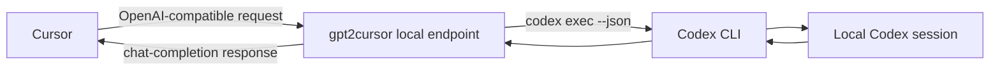

<p align="center">
  
</p>

<h1 align="center">gpt2cursor</h1>

<p align="center">
  A polished macOS menu-bar bridge that lets Cursor talk to your locally logged-in Codex CLI through an OpenAI-compatible endpoint.
</p>

<p align="center">
  <a href="README-CN.md">简体中文</a>
  ·
  <a href="https://github.com/ingeniousfrog/gpt2cursor/releases">Releases</a>
</p>

<p align="center">
  
  
  
  
  
  
</p>

<p align="center">
  Last updated: 2026-06-16
</p>

## Why It Exists

Cursor can use OpenAI-compatible providers, while Codex CLI already knows how
to work with your local Codex login. `gpt2cursor` sits between them as a native,
local-first bridge: Cursor sends chat-completion requests to `127.0.0.1`, and
the app turns them into `codex exec --json` sessions on the same Mac.

No cloud relay. No account-sharing service. No replacement for the official
OpenAI API. Just a focused local bridge for personal development experiments.

## Highlights

- Native macOS menu-bar app built with Tauri, Rust, React, and Tailwind CSS.
- OpenAI-compatible local endpoints for Cursor:
  `GET /v1/models`, `GET /healthz`, and `POST /v1/chat/completions`.
- Local bearer key protection with either a user-provided key or a generated
  `g2c_...` key.
- Live panel for Base URL, port status, bridge status, active requests, latest
  latency, and per-session token usage.
- Current Cursor support is focused on **Ask** and **Agent** modes; other
  Cursor modes are planned but not supported yet.
- Optional ngrok integration for Cursor Agent mode, including public Base URL
  display and local authtoken reuse.
- macOS launch-at-login support through a native LaunchAgent.
- Installer-style DMG with drag-to-Applications layout.

## Architecture



## Cursor Setup

Start the bridge from the menu-bar app, then add an OpenAI-compatible provider
in Cursor.

| Setting | Value |
| --- | --- |
| Base URL | `http://127.0.0.1:8787/v1` by default, or the Base URL shown in the app |
| API Key | The local key shown in gpt2cursor |
| Model | `gpt2cursor-local` |

Cursor does not automatically fetch models from a custom Base URL. Open Cursor
Settings, go to Models, click **+ Add Custom Model**, and add
`gpt2cursor-local` manually.

## Supported Cursor Modes

`gpt2cursor` currently supports Cursor's **Ask** and **Agent** modes.

| Cursor mode | Status | Notes |
| --- | --- | --- |
| Ask | Supported | Works with the local Base URL, usually `http://127.0.0.1:8787/v1`. |
| Agent | Supported | Requires the public tunnel when Cursor routes requests through its cloud. |
| Other modes | Planned | Not supported yet; behavior may vary and is still under development. |

<p align="center">
  
</p>

<p align="center">
  
</p>

## Local API Key

The API key shown in the app protects this local service only. Cursor sends it
as `Authorization: Bearer <key>`, and `gpt2cursor` checks it before a request
can reach your local Codex CLI.

It is not an OpenAI API key, is not sent to OpenAI by this project, and should
not be described or treated as an official OpenAI credential.

## Public Tunnel For Cursor Agent

Cursor Agent routes requests through Cursor's cloud, which cannot reach
`127.0.0.1`. To use gpt2cursor with Agent mode, enable **Public Tunnel** and
provide your own ngrok setup.

1. Install [ngrok](https://ngrok.com/download) on the same machine.
2. In gpt2cursor, enable **Public Tunnel**. If you already ran
   `ngrok config add-authtoken`, the app reuses that login automatically.
3. Click **Start**. The app starts the local bridge and an ngrok tunnel.
4. Copy the public Base URL shown in the panel into Cursor Settings.
5. Paste the gpt2cursor API key and add custom model `gpt2cursor-local`.

Notes:

- Each user needs their own ngrok account and authtoken.
- Free ngrok URLs may change when the tunnel restarts.
- The public endpoint is protected by your gpt2cursor API key, but exposing a
  local Codex bridge to the internet still carries risk. Use only for personal
  experiments.

## App Controls

| Control | Purpose |
| --- | --- |
| Port | Defaults to `8787`; checked before saving and starting |
| API Key | Paste your own local key or generate a random `g2c_...` key |
| Start / Stop | Starts or stops the native Rust HTTP bridge |
| Usage | Shows request count, active requests, latest duration, and cumulative tokens |
| Codex Account | Best-effort local CLI status; quota is unavailable when the CLI does not expose it |
| Public Tunnel | Optional ngrok tunnel for Cursor Agent mode |
| Launch at login | Adds or removes the macOS LaunchAgent |

## macOS Install

Release builds are adhoc-signed for local use. After downloading the DMG from
GitHub Releases:

1. Open the DMG.
2. Drag **gpt2cursor** onto the **Applications** folder shortcut.
3. Launch **gpt2cursor** from `/Applications`.

If macOS says the app cannot be opened because the developer cannot be verified,
right-click **gpt2cursor** in Applications and choose **Open**, then confirm
**Open** again. You can also go to **System Settings -> Privacy & Security**
and click **Open Anyway**.

If macOS still blocks the app, or shows **"gpt2cursor is damaged and can't be
opened"**, remove the quarantine attribute in Terminal:

```sh
xattr -cr /Applications/gpt2cursor.app
```

Then open **gpt2cursor** again from Applications.

This is expected for local adhoc-signed builds that are not notarized by Apple.
Builds from `npm run tauri:build` still run an extra signing step so the DMG is
not rejected for a broken resource seal.

## Development

Requirements:

- Node.js 20 or newer.
- Rust 1.78 or newer.
- Codex CLI installed and logged in on the same machine.

Useful commands:

```sh
npm install
npm run build
npm run tauri
npm test
```

For release packaging:

```sh
npm run tauri:build
```

The Rust tests bind temporary localhost ports for integration coverage.

## Project Status

`gpt2cursor` is designed for personal local development experiments. The bridge
is intentionally narrow: it focuses on Cursor, Codex CLI, local request
translation, and macOS packaging quality.
