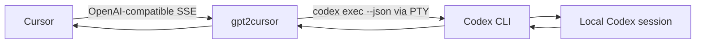

<p align="center">
  
</p>

<h1 align="center">gpt2cursor</h1>

<p align="center">
  A native local bridge that lets Cursor talk to your locally logged-in Codex CLI through an OpenAI-compatible endpoint.
</p>

<p align="center">
  <a href="README-CN.md">简体中文</a>
  ·
  <a href="docs/HOW_TO_USE.md">How to Use</a>
  ·
  <a href="https://github.com/ingeniousfrog/gpt2cursor/releases">Releases</a>
</p>

<p align="center">
  
  
  
  
  
  
</p>

<p align="center">
  Last updated: 2026-06-16
</p>

## Quick Start

1. Download the latest [Release](https://github.com/ingeniousfrog/gpt2cursor/releases).
2. Install and open **gpt2cursor**, then click **Start**.
3. In Cursor, add model `gpt2cursor-local` with the Base URL and API key from the panel.
4. Use **Ask** with `http://127.0.0.1:8787/v1`, or **Agent** with the public ngrok URL.

Full walkthrough: [docs/HOW_TO_USE.md](docs/HOW_TO_USE.md)

## Downloads

| Platform | Artifact | Status |
| --- | --- | --- |
| macOS (Apple Silicon) | `gpt2cursor_0.4.1_aarch64.dmg` | Stable |
| Windows (x64) | `gpt2cursor_0.4.1_x64-setup.exe` | Experimental |

Runtime requirements: **Codex CLI logged in on the same machine**. Node.js is **not** required for end users.

## Why It Exists

Cursor supports OpenAI-compatible providers. Codex CLI already uses your local login.
`gpt2cursor` sits between them: Cursor sends chat-completion requests to a local
endpoint, and the app turns them into `codex exec --json` over PTY with streaming
SSE back to Cursor.

No cloud relay. No account-sharing service. Not a replacement for the official OpenAI API.

## Highlights

- Native Tauri app (macOS menu-bar + Windows tray).
- OpenAI-compatible endpoints: `GET /v1/models`, `GET /healthz`, `POST /v1/chat/completions`.
- PTY streaming bridge for Cursor Ask / Agent compatibility.
- Local bearer key (`g2c_...`) protecting the bridge.
- Activity panel with live request logs.
- Optional ngrok public tunnel for Cursor Agent mode.
- Configurable Codex timeout and context trimming.

## Supported Cursor Modes

| Cursor mode | Status | Base URL |
| --- | --- | --- |
| Ask | Supported | Local `http://127.0.0.1:8787/v1` |
| Agent | Supported | Public ngrok HTTPS URL |
| Other modes | Planned | Not supported yet |

<p align="center">
  
</p>

<p align="center">
  
</p>

## Architecture



## Cursor Setup (Summary)

| Setting | Value |
| --- | --- |
| Base URL | From gpt2cursor panel (local for Ask, public for Agent) |
| API Key | Local key from gpt2cursor panel |
| Model | `gpt2cursor-local` (add manually in Cursor Settings → Models) |

Details: [docs/HOW_TO_USE.md](docs/HOW_TO_USE.md)

## Install (Summary)

### macOS

1. Open DMG → drag to **Applications** → launch.
2. If blocked: right-click **Open**, or run `xattr -cr /Applications/gpt2cursor.app`.

### Windows

1. Run `gpt2cursor_0.4.1_x64-setup.exe`.
2. If SmartScreen warns: **More info → Run anyway**.

Install and troubleshooting details: [docs/HOW_TO_USE.md](docs/HOW_TO_USE.md)

## Documentation

| Doc | Description |
| --- | --- |
| [HOW_TO_USE.md](docs/HOW_TO_USE.md) | Step-by-step setup for Ask / Agent, ngrok, troubleshooting |
| [HOW_TO_USE_CN.md](docs/HOW_TO_USE_CN.md) | 中文使用指南 |
| [README-CN.md](README-CN.md) | 中文项目说明 |

## Development

```sh
npm install
npm run tauri          # dev
npm test               # Rust integration tests
npm run tauri:build    # macOS DMG + sign script
```

Requirements: Node.js 20+, Rust 1.78+, Codex CLI. Windows installers are built via
[`.github/workflows/build-windows.yml`](.github/workflows/build-windows.yml).

## Project Status

Personal local development experiments only. Current focus: Cursor Ask/Agent,
Codex CLI bridging, and cross-platform packaging.
